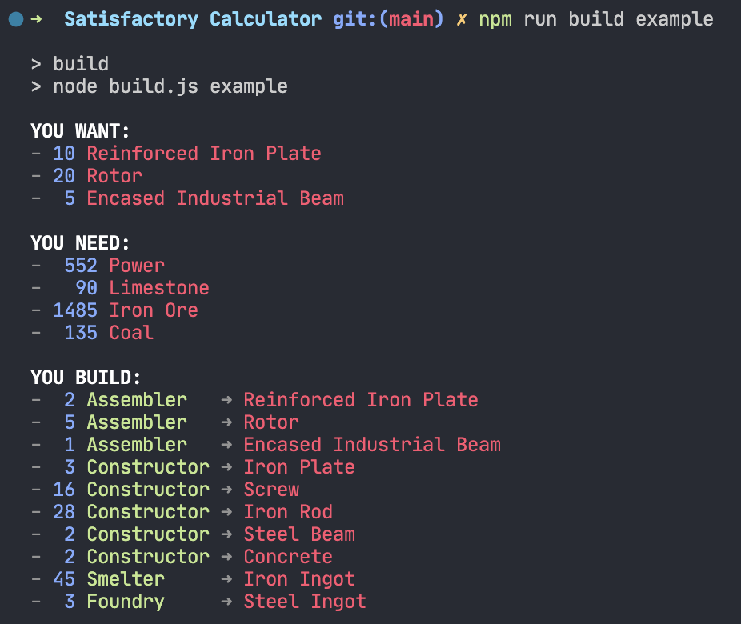

 When building my vast and shiny factories in [Satisfactory](https://www.satisfactorygame.com/), I want to know what combination of 1) resources and 2) buildings I need to assemble in order to produce 3) a certain set of outputs per minute. I made this calculator for my own use because it seemed easier than actually doing the math.

## Usage

1. Clone the repository and do `npm install`.
2. In the “requests” directory, create a YAML file with the outputs you want to achieve. (See below for an example.)
3. Run the `build` script, passing the base name of your YAML file.

## Plans

- [ ] Better documentation.
- [ ] Prettier terminal output.
- [ ] Finish populating the static database of buildings, components and resources.
- [ ] Extend prescriptions to include power generation and mining configurations.
- [ ] Handle parts with multiple production methods.
- [ ] Handle formulas that output multiple parts (I don’t even know if these exist in the game, but even if they don’t now, they might someday).
- [ ] Maybe a web UI?

## Example

### Input

Saved to `./requests/steel-and-concrete.yml`:

```yaml
reinforcedIronPlate: 10
rotor: 20
encasedIndustrialBeam: 5
```

### Command

`npm run build steel-and-concrete`

### Output



## How It Works

